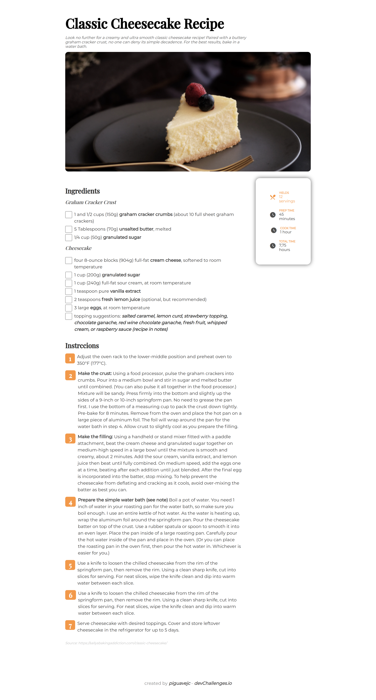

<main>
<section>
    <h1 align="center"> Recibe Page Master   </h1>
</section>
 <section>
    <h3 align="center"> Solución para un desafío de <a href="https://devchallenges.io/">Devchallenges.io</a> </h3>

<section align="left">
     <h2> Tabla de Contenido </h2>
</section>
<nav>
    <ul>
        <li><a href="https://github.com/jean-carlos-19/recipe-page-master#-descripci%C3%B2n-general-">Descripciòn General</a></li>
        <li><a href="https://github.com/jean-carlos-19/recipe-page-master#-soluci%C3%B2n-">Soluciòn</a></li>
        <li><a href="https://github.com/jean-carlos-19/recipe-page-master#-construido-con-">Construido Con</a></li>
        <li><a href="https://github.com/jean-carlos-19/recipe-page-master#-contacto-">Caracteristicas</a></li>
        <li><a href="https://github.com/jean-carlos-19/recipe-page-master#-contacto-">Contacto</a></li>    
    </ul>
</nav>
<section >
    <section>
        <h2 > Descripciòn General </h2>
    </section>
    <section >
         
    <section>
     <section >
         
    <section>
   
</section>

</section>
    <section >
    <h2> Soluciòn </h2>
    <nav>
        <ul align="center">
            <h3>
                <a href="https://piguavejc-interior-consultant-gg9c.onrender.com/"">Demo</a> | 
                <a href="https://github.com/jean-carlos-19/recipe-page-master">Github </a> | 
                <a href="https://devchallenges.io/solutions/GWX3kuLp8gDKOQ34BzPM">Devchallenge</a> </a> | 
                <a href="https://www.figma.com/proto/2jVBTSKeCYF0dIN6fi0stX/recipe-blog-challenge?node-id=0%3A1&scaling=min-zoom&page-id=0%3A1">Figma<a>
            </h3>
        </ul>
    </nav>
</section>

<section >
    <section>
        <h2> Construido Con </h2>
    </section>
    <nav>
        <ul>
            <li>HTML</li>
            <li>CSS</li>
            <li>
                Preprocesadores
                <ul>
                    <li>SASS</li>
                </ul>
            </li>
        </ul>
    </nav>
</section>
<section >
    <h2> Caracteristicas </h2>
    

        Esta aplicación o sitio fue creada como una presentación a un desafío de <a href="http://devchallenges.io" target="_blank">Devchallenges.io</a>. El reto consistía en construir una aplicación para completar las historias de usuario dadas.
    

      

        Desafío: crea una página de recetas siguiendo el diseño dado. Puedes usar tu propia receta y recuerda poner la fuente. La página debe responder. No mire las soluciones existentes. Cumplir con las historias de usuario a continuación:.
    

     <nav>.
        <ul>
            <li>Historia de usuario: puedo ver una receta con ingredientes e instrucciones</li>
            <li>Historia de usuario: puedo seleccionar una casilla de verificación si tengo los ingredientes</li>
            <li>Historia de usuario: puedo ver la cantidad de porciones, los tiempos de horneado</li>
        </ul>
    </nav>
</section>
<section >
     <section>
        <h2> Contacto </h2>
    </section>
    <nav>
        <ul>
                <li>Github <a href="https://github.com/jean-carlos-19">@jean-carlos-19</a></li>
                <li>Twitter <a href="https://twitter.com/PiguaveJean">@PiguaveJean</a></li>
        </ul>
</nav>
</section>
</main>
